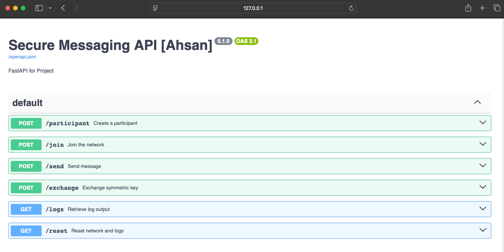

**Course:** Computer Security, University of Oklahoma  
**Author:** Ahsan Bilal  

## Description

This project demonstrates a secure protocol over an insecure broadcast network. It leverages RSA for key exchange and AES/DES for encrypting message payloads, showcasing how cryptographic techniques can secure communication even when transmitted over a fully public channel.

## Repository Structure

```
github.com/AhsanBilal7/
├── README.md
├── main.py
├── app.py
└── src/
    ├── __init__.py
    ├── logging.py
    ├── network.py
    ├── person.py
    ├── message.py
    ├── RSA_utils.py
    ├── cryp.py
    └── fun_introduction.py
```

### File Names

- **main.py**  
  Demonstration script for running the secure src scenario.

- **app.py**  
  FastAPI application wrapping the secure src demo with HTTP endpoints.

- **src/__init__.py**  
  Marks the `src` directory as a Python package and exposes submodules.

- **src/logging.py**  
  Configures application-wide logging.

- **src/network.py**  
  Implements the insecure broadcast network (`NetworkClass`).

- **src/person.py**  
  Defines the `PersonClass` class, handling key exchange and secure src.

- **src/message.py**  
  MessageClass container class.

- **src/RSA_utils.py**  
  RSA key generation and encryption/decryption helpers.

- **src/cryp.py**  
  AES/DES cipher wrapper (`CipherClass`).

- **src/fun_introduction.py**  
  Utility decorators (e.g., `introduce`).

## Prerequisites

- Python 3.7 or higher  
- [pycryptodome](https://pypi.org/project/pycryptodome/)  
- [FastAPI](https://fastapi.tiangolo.com/) and [Uvicorn](https://www.uvicorn.org/)

Install dependencies:

```bash
pip install pycryptodome fastapi uvicorn pydantic
```

## Usage

### Run the example script

```bash
python main.py
```

You should see log output illustrating plaintext and encrypted message exchanges, as well as key exchange steps.

### Run the FastAPI server

```bash
uvicorn app:app --reload
```

Visit the interactive docs at `http://127.0.0.1:8000/docs` to explore endpoints.

### Example Usage
#### 1) Add a participant

#### 2) Join a participant

#### 3) Sending a plain message

#### 4) Get the logs message

#### 5) Exchange the key for secure message

`Exchange the key for secure message. Now Repeat step 3 and 4.`
#### 6) Get the logs message

## API (FastAPI)

This project includes a FastAPI application (`app.py`) providing HTTP endpoints to interact with the secure src network programmatically:

- **POST /participant**  
  Create a new participant.  
- **POST /join**  
  Add a participant to the network.  
- **POST /send**  
  Send a message between participants.  
- **POST /exchange**  
  Exchange a symmetric key securely.  
- **GET /logs**  
  Retrieve the sequence of log entries.  
- **GET /reset**  
  Clear network state and logs.  

## License

This project is released under the MIT License. See the [LICENSE](LICENSE) file for details.
