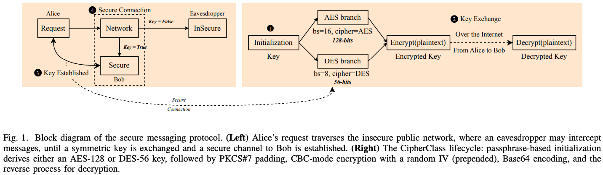
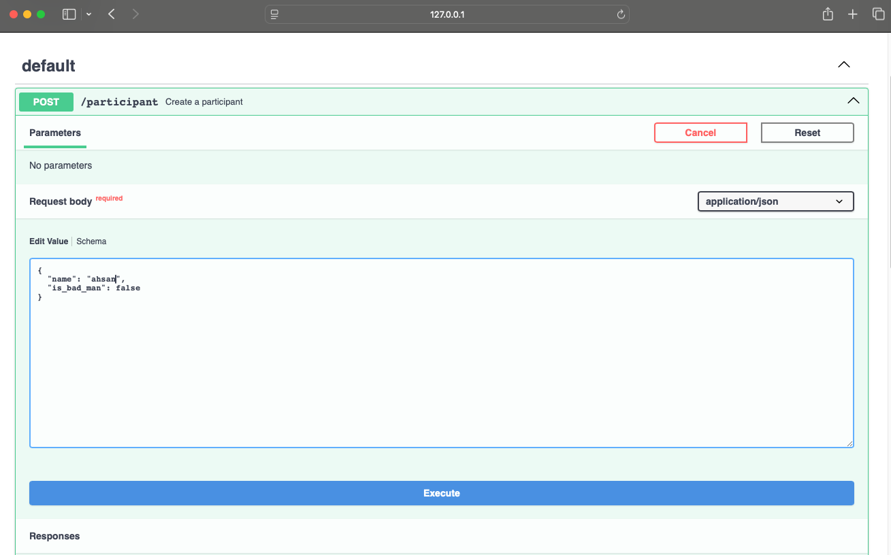
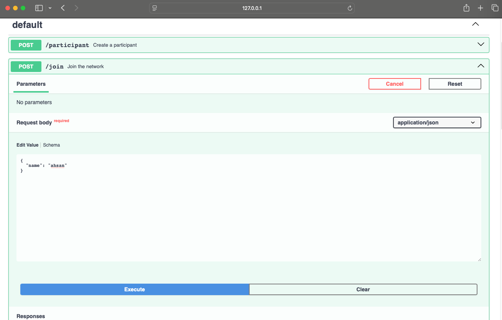
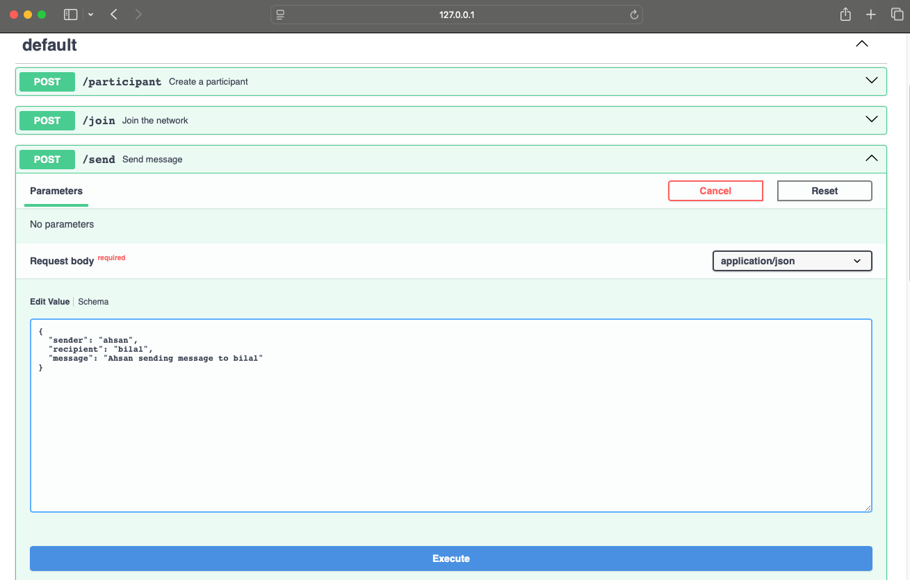
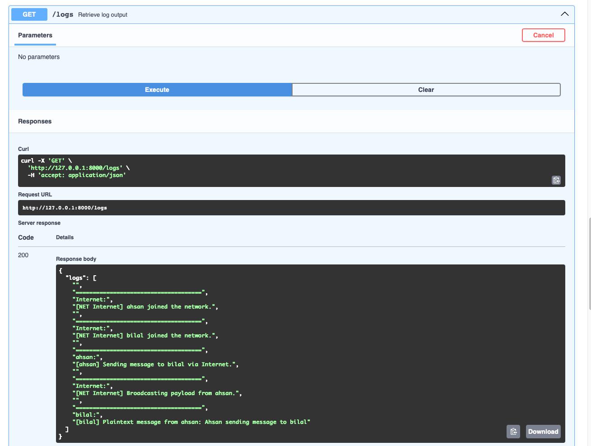
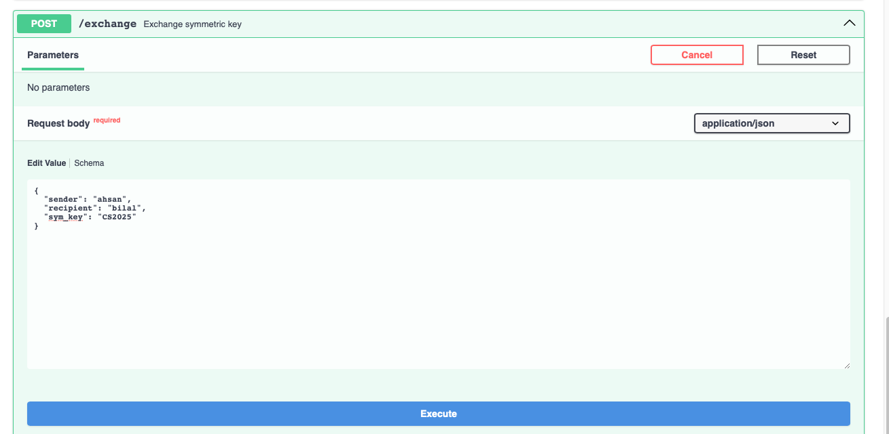
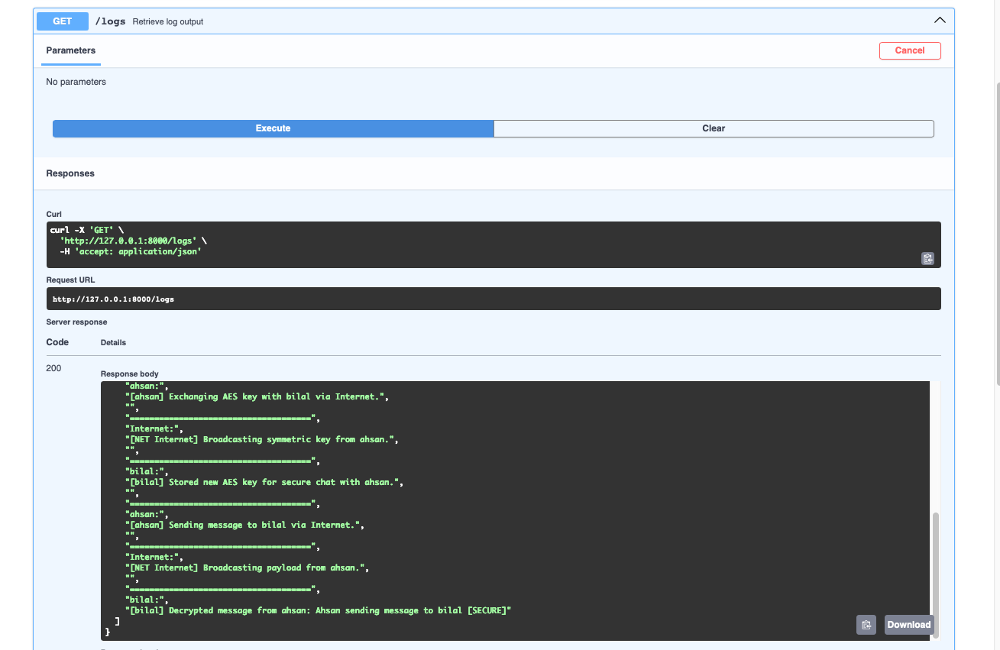

**Course:** Computer Security – University of Oklahoma  
**Author:** Ahsan Bilal  

# 🔐 Secure Messaging System

This project demonstrates a secure protocol over an insecure broadcast network. It leverages **RSA for key exchange** and **AES/DES for encrypting message payloads**, showcasing how cryptographic techniques can secure communication even when transmitted over a fully public channel.


---

## 🚀 Quick Start
###
```bash
# person.py

# For n bits key
# Options:
#   "DES" – uses 56-bit Data Encryption Standard
#   "AES" – uses 128-bit Advanced Encryption Standard
ALGO = "AES"  # Change to "DES" if desired

```

### 1. Open three separate terminals and run:
```bash
# Run this in the 1st terminal
python secure_chat.py Alice

# Run this in the 2nd terminal  
python secure_chat.py Bob

# Run this in the 3rd terminal
python secure_chat.py Eavesdropper
```

---

## 🔍 Test Instructions

### ✅ Test 1: Unencrypted Communication is Vulnerable to Interception

```bash
Alice> join Bob
Alice> join Eavesdropper

Bob> join Alice
Bob> join Eavesdropper

Eavesdropper> join Alice
Eavesdropper> join Bob

Alice> send Bob Meeting at the library at 3 PM today

Bob> messages
Eavesdropper> listen
```

- ✅ Bob receives the message
- ⚠️ Eavesdropper **can also read the message**
- 🔓 Demonstrates the risk of **unencrypted communication**

---

### 🔐 Test 2: RSA-Based Symmetric Key Exchange Protects the Session Key

```bash
Alice> exchange Bob MySecretKey2025
Bob> exchange Alice MySecretKey2025

Alice> send Bob Encrypted Meeting at the library at 3 PM today
Eavesdropper> listen
Bob> messages
```

- ✅ Key exchange success
- 🔒 RSA protects key exchange
- ⚠️ Eavesdropper **cannot extract the symmetric key**

---

### 🔒 Test 3: Encrypted Messaging Prevents Attacker Access

```bash
Alice> send Bob This is a secret encrypted message about our project
Bob> send Alice Received your encrypted message safely!

Alice> messages
Bob> messages
Eavesdropper> listen
```

- ✅ Alice & Bob see plaintext
- 🔒 Eavesdropper sees encrypted garbage

---

## 📊 Summary Table

| Test | Security Concept | Outcome |
|------|------------------|---------|
| Test 1 | Unencrypted Vulnerability | Eavesdropper sees plaintext |
| Test 2 | RSA Key Exchange | Symmetric key protected |
| Test 3 | Encrypted Messaging | Eavesdropper blocked |

---

## 📂 Repository Structure

```
github.com/AhsanBilal7/
├── README.md
├── main.py
├── secure_chat.py
├── app.py
└── src/
    ├── __init__.py
    ├── logging.py
    ├── network.py
    ├── person.py
    ├── message.py
    ├── RSA_utils.py
    ├── cryp.py
    └── fun_introduction.py
```

---

## 🌐 FastAPI Usage

### Start the Server
```bash
uvicorn app:app --reload
```

Visit docs at: [http://127.0.0.1:8000/docs](http://127.0.0.1:8000/docs)

### Endpoints
- `POST /participant` – Add a participant
- `POST /join` – Add to network
- `POST /send` – Send a message
- `POST /exchange` – Exchange symmetric key
- `GET /logs` – View logs
- `GET /reset` – Reset state

---

## 🛠️ Troubleshooting

| Issue | Fix |
|-------|-----|
| No messages | `Alice> exchange Bob TestKey123` |
| Participants not found | `Alice> join Bob` |
| Command fails | `Alice> help` |

---

## 🔧 Prerequisites

- Python 3.7+
- [`pycryptodome`](https://pypi.org/project/pycryptodome/)
- [`fastapi`](https://fastapi.tiangolo.com/)
- [`uvicorn`](https://www.uvicorn.org/)

Install:
```bash
pip install pycryptodome fastapi uvicorn pydantic
```

---

## 📷 Demo Screenshots

- Add participant  
  
- Join participant  
  
- Send message  
  
- Logs  
  
- Key exchange  
  
- Encrypted logs  
  

---

## 📘 Educational Notes

- 🔐 Educational system to demonstrate secure messaging
- 🌍 Simulated public network
- 🛑 Not suitable for real-world security without enhancements
- ✅ Authorized and ethical use only

---

## 📄 License

MIT License – see [LICENSE](LICENSE)

---

